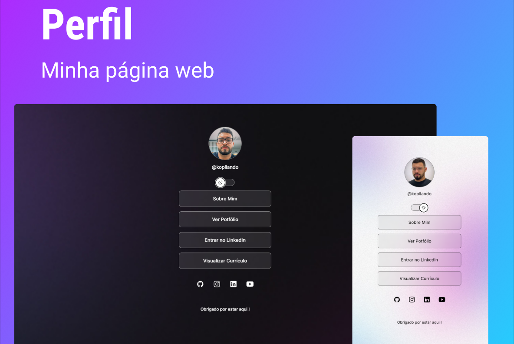

## 💻 Projeto

Programa gratuito, promovido pela rocketseat para ensino de tecnologias Web.

Onde foi feito por mim!

Acesse: https://carllostavares.github.io/PerfilContatoMobile/

A pagina "Sobre Mim" está em desenvolvimento !

## ✨ Construído com:

   

## 🔖 Layout

[Acessar Figma](https://www.figma.com/file/7UXtquWFbhOyG8qX2NmxCk/DevLinks-(Community)?node-id=90%3A160&t=1BFWrdiJkw6ploMB-0)

## Licença

Este projeto está sobre licença MIT.
